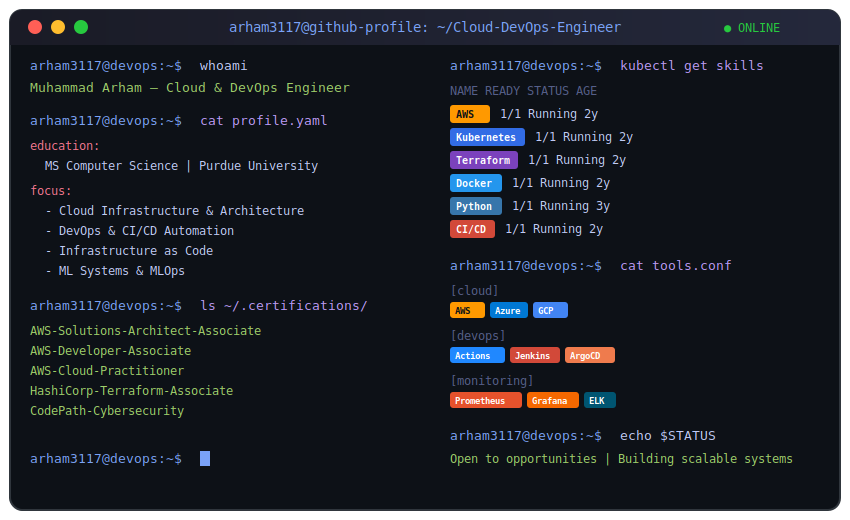

<!-- Animated Header Banner -->

<h3>
   
  DevOps • Cloud • Security • ML Engineer
  
</h3>

  
  

---

<!-- Terminal SVG -->

---

## 🛠️ Tech Arsenal

<table>
<tr>
<td align="center" width="50%">

### ☁️ Cloud & Infrastructure

</td>
<td align="center" width="50%">

### 🔄 CI/CD & DevOps

</td>
</tr>
<tr>
<td align="center" width="50%">

### 🤖 ML & Data

</td>
<td align="center" width="50%">

### 🔐 Security & Monitoring

</td>
</tr>
</table>

---

## 🏆 Certifications

---

## 🤝 Let's Connect

 

**💚 Always learning. Always building. Always shipping.**

